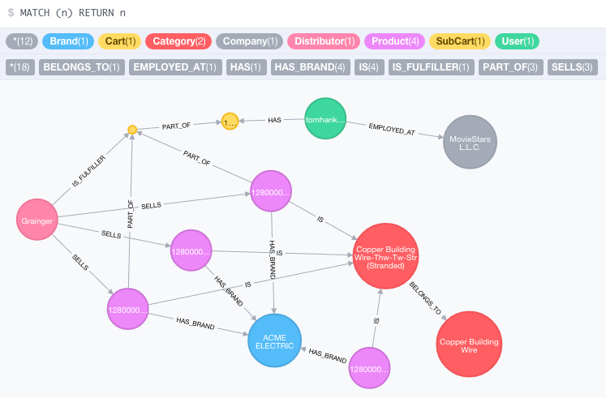

#SupplyHub Challenge

With this challenge you're asked to complete several user stories:

- as a buyer I can buy stuff
- as a distributor I get paid when buyers buy stuff
- as SupplyHub we're getting 3% of the purchase price

You will need to set up a [Stripe](https://stripe.com/) account and get Neo4j up and running locally.

You're provided with a small graph that already has a user with a cart object. You're task is to handle the checkout process of these products. The total checkout price should be $2099.97.

97% of the purchase price will go to the distributor for which you'll have to set up a [managed account](https://stripe.com/docs/connect/managed-accounts), which you can do manually. Don't forget to set a stripeId property on the distributor node that reflects the id of the managed stripe account. The rest of the money will stay in the stripe user's account.

You don't have to worry about [securing that API](https://tools.ietf.org/html/rfc7519) end point.

When the transaction is successful, an order object should be created. This can be in neo4j or any other database you think would be beneficial for analytical purposes. In the next step, the cart and subcart have to be cleared for the user.

The frontend part can be very simplistic. Plain javascript, angularjs and/or polymer are all great choices. The use of jQuery is frowned upon at SupplyHub, but it won't hurt you (much) for this challenge.

You may use nodejs (we like [hapijs](http://hapijs.com/)), golang, c++, or python for providing the API. You will need to use the Neo4j data provided.

No idea how to write cypher for node? Give [cypher-rest](https://www.npmjs.com/package/cypher-rest) a try.


##Neo4j Set Up
####Using Docker
If you're familiar with docker, you can just run ```docker run -p 7474:7474 manonthemat/supplyhub-challenge``` to get Neo4j 2.2.5 up and running with the test database.

####Manual
For manual setup I recommend using Neo4j 2.2.5 or higher, disabling authentication and run

    neo4j-shell -file create.neo

from the command line on an empty graph.db.

##Data Model Overview
###Nodes
####(:Product)
Products have several somewhat important properties on them.
As a minimum it has a *upc* (as a number) which is a unique identifier for products and a *slug* (unique), which is part of the path in API calls via http(s).

####(:Category)
All category nodes have a *name* and a unique *slug* as properties.
In the example graph, there are only two categories.

####(:Brand)
All brand nodes have at a minimum a *name* and a unique *slug* as properties.
The only brand in this example is ACME ELECTRIC.

####(:Distributor)
All distributor nodes have at a minimum a *name* and a unique *slug* as properties. Distributors will need to have a *stripeId*. We've set Grainger as distributor. You'll need to give this distributor a stripeId (from a striped managed account).

####(:Company)
A company reflects a buying organization. At a minimum it has a *name* and *slug* for the purpose of this exercise. In reality there's a lot more info stored on this type of node. We don't really need to do anything with this node right now.

####(:User)
On a user node you'll find user information. For the sake of this exercise lets limit the properties to *email* (which is a unique constraint). We're using tomhanks@example.com for the one company node in this example.

####(:Cart) and (:SubCart)
Nodes without any explicit set properties.


###Relationships
####(:Category)-[:BELONGS_TO]->(:Category)
We have one category tree with about 1500 distinct categories with single-digit level depth. In this example it's only one parent and a child category.

####(:Product)-[:IS]->(:Category)
A product is always part of exactly one category. In this example, all products belong to one leaf category.

####(:Product)-[:HAS_BRAND]->(:Brand)
A product has exactly one brand. In our example it is ACME ELECTRIC.

####(:Distributor)-[:SELLS]->(:Product)
Many distributors sell the same products. Pricing information is stored on the SELLS relationship type. You'll find properties like *inStock* (integer) for the amount of products that the distributor has ready to ship, and *sellsFor* (float) for pricing information. Some distributors store a *sku* for a product, too. This information is also stored on the edge itself. In this example our one distributor is selling three out of the four available products in the database.

####(:User)-[:HAS]->(:Cart)<-[:PART_OF]-(:SubCart)<-[:IS_FULFILLER]-(:Distributor)
A user has exactly one cart with up to one subcart per distributor.

####(:SubCart)<-[:PART_OF]-(:Product)
The relationship has properties like *amount* and *unitPrice* for every product. Our user wants to buy two products.

####(:User)-[:EMPLOYED_AT]->(:Company)
A user is employed at a company. Not so important right now, but you might want to include the company information in the stripe transaction as meta info.
